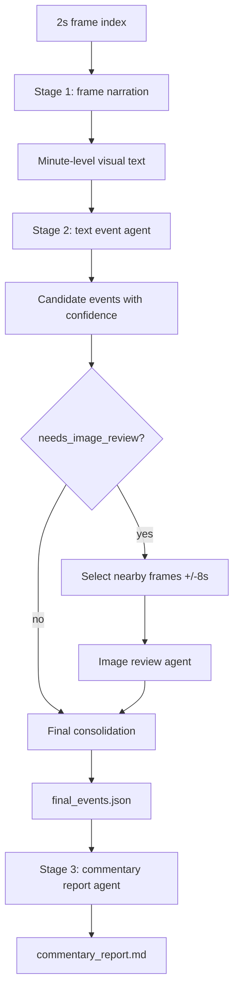

# World Cup Commentary Harness - Version 2 Handoff

## What This Package Contains

This package is a runnable handoff for the Version 2 World Cup video commentary pipeline.

It includes:

- Core Python implementation.
- Version 2 run script.
- Version 2 generated outputs.
- Architecture and parameter notes.
- Logs and runtime summaries.

It intentionally excludes:

- `.env` and real API keys.
- The original large MP4 video.
- Extracted frame image folders.
- Python cache folders.

## Version 2 Run Result

Input video task:

- Match: Germany vs Curacao
- Frame index: `outputs_visual_full_safe/frame_index_2s.json`
- Frame interval: `2 seconds/frame`

Completed outputs:

- Frame narration: `outputs_frame_narration_v2`
- Event timeline: `outputs_event_agent_v2`
- Commentary report: `outputs_script_report_v2`

Key numbers:

| Stage | Result |
|---|---:|
| Frame narration segments | `111` |
| Frame narration success | `111 / 111` |
| Frame narration `finish_reason=length` | `0` |
| Text chunks | `10` |
| Text candidate events | `39` |
| Image review calls | `16` |
| Final events | `35` |
| Commentary report status | `ok=true`, `finish_reason=stop` |

Important quality note:

- The pipeline ran successfully, but `final_events.json` and `commentary_report.md` still contain factual issues in the goal chain.
- Read `video_text_pipeline/version2_quality_audit.md` before treating the generated report as final.
- Current outputs are suitable for architecture/demo handoff, not yet for final factual delivery.

## Architecture



## Fixed Version 2 Parameters

### Stage 1: Frame Narration

| Parameter | Value |
|---|---:|
| frame interval | `2 seconds/frame` |
| segment length | `60 seconds` |
| max images/request | `30` |
| concurrency | `3` |
| rpm_limit | `15` |
| temperature | `0.1` |
| max_tokens | `6000` |

### Stage 2: Event Agent

| Parameter | Value |
|---|---:|
| chunk_segments | `12` |
| text chunk coverage | about `12 minutes` |
| concurrency | `3` |
| rpm_limit | `12` |
| temperature | `0.1` |
| text_max_tokens | `10000` |
| review window | `+/-8 seconds` |
| review max frames | `9` |
| final max events requested | `30` |

Note: final output currently contains `35` events because the final agent returned more than the requested count. This should be tightened in the next iteration if strict count control matters.

### Stage 3: Script Report

| Parameter | Value |
|---|---:|
| input | `outputs_event_agent_v2/final_events.json` |
| temperature | `0.2` |
| max_tokens | `10000` |
| output | `outputs_script_report_v2/commentary_report.md` |

## TPM/RPM Estimate

Current API limits:

- RPM: `30`
- TPM: `300000`

Worst-case estimates under Version 2 parameters:

| Stage | Estimate |
|---|---:|
| Frame narration | `18,487 tokens/request * 15 RPM = 277,305 TPM` |
| Text event agent | `21,133 tokens/request * 12 RPM = 253,596 TPM` |
| Image review | `8,518 tokens/request * 12 RPM = 102,216 TPM` |
| Script report | single request, no sustained RPM pressure |

## How To Re-run

Prepare `.env` locally, based on `.env.example`:

```env
INTERN_S2_API_BASE=https://chat.intern-ai.org.cn/api/v1
INTERN_S2_API_KEY=your_api_token_here
INTERN_S2_MODEL=intern-s2-preview
```

Then run:

```powershell
powershell -ExecutionPolicy Bypass -File scripts/run_version2_test.ps1
```

Check status:

```powershell
Get-Content version2_test_status.json
Get-Content logs/version2_test.stdout.log -Tail 50
Get-Content logs/version2_test.stderr.log -Tail 50
```

## Important Files

```text
src/
run_frame_narration.py
run_event_agent.py
run_script_report.py
scripts/run_version2_test.ps1
examples/match_info.germany_curacao.json
outputs_frame_narration_v2/match_observation_timeline.md
outputs_frame_narration_v2/segment_descriptions.json
outputs_event_agent_v2/final_events.json
outputs_event_agent_v2/event_agent_report.md
outputs_script_report_v2/commentary_report.md
video_text_pipeline/version2_test_handoff.md
```

## Current Pipeline Behavior

The event agent is fixed-stage, not an open-ended tool loop:

1. Each 12-minute text chunk produces candidate events.
2. Each event decides whether it needs image review.
3. If `needs_image_review=true`, the code selects nearby frames.
4. Image review confirms, corrects, rejects, or marks uncertain.
5. Final consolidation merges duplicates and emits `final_events.json`.
6. Script report generation turns final events into a readable Markdown commentary report.

## Web Demo Idea

Use `final_events.json` as the menu source:

- Big menu: event type, such as goal, replay, free kick, substitution.
- Small menu: event index or richer label, such as time, score, title.
- Clicking an event opens the nearby video clip and dynamic commentary subtitle.

This demonstrates the full chain:

```text
video evidence -> detected event -> reviewed evidence -> generated commentary
```
